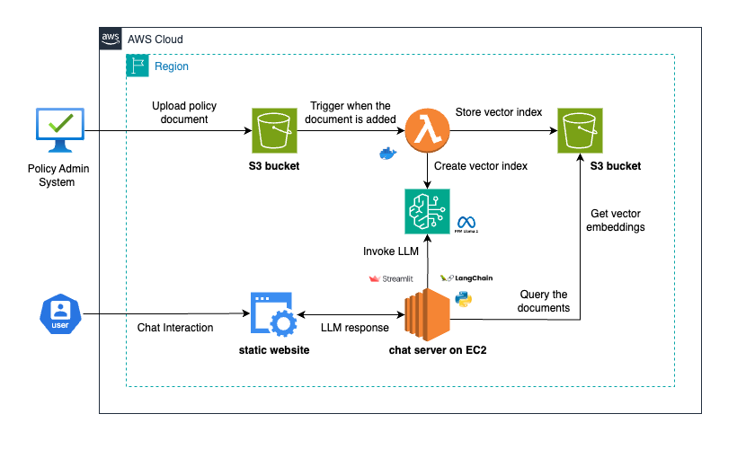

# IVA: Retrieval-Augmented-Generation Chatbot

IVA(Insurance Virtual Agent) is a prototype chatbot designed to retrieve and generate answers to policy holders' queries based on policy documents. The chatbot leverages AWS Bedrock and other AWS services such as Lambda, EC2, S3, along with LangChain and Docker, to deliver efficient and accurate responses.   


## Features

- **Retrieval-Augmented-Generation (RAG)**: Combines retrieval of relevant document snippets with natural language generation to provide detailed answers.
- **AWS Integration**: Utilizes AWS Bedrock for the language model, with infrastructure support from AWS Lambda, EC2, and S3.
- **LangChain Framework**: Employs LangChain for building and managing the conversation flow and document retrieval.
- **Dockerized Deployment**: Packaged in Docker for easy deployment and scaling.

## Architecture



## Components

1. **AWS Bedrock**: Provides the core language model capabilities for understanding and generating natural language responses.
2. **AWS Lambda**: Used for serverless computing tasks to handle backend processes and integrations.
3. **Amazon EC2**: Hosts the chatbot application and handles processing tasks.
4. **Amazon S3**: Stores policy documents and vector embeddings for quick retrieval.
5. **LangChain**: Framework used to integrate the language model with document retrieval mechanisms.
6. **Docker**: Ensures the chatbot can be easily deployed, managed, and scaled across different environments.

## How It Works

1. **Document Ingestion**: Policy documents are ingested and stored in Amazon S3.
2. **Vectorization**: Documents are vectorized using embeddings and stored for efficient retrieval.
3. **User Query**: A policy holder submits a query through the chatbot interface.
4. **Retrieval**: The chatbot retrieves relevant document snippets based on the query.
5. **Generation**: Using the retrieved snippets, the chatbot generates a detailed response.
6. **Response Delivery**: The generated response is sent back to the user.

## Getting Started

### Prerequisites

- AWS account with necessary permissions for Bedrock, Lambda, EC2, and S3.
- Docker installed on your local machine or server.
- Python installed for running LangChain and other necessary scripts.

### Installation

1. **Clone the repository**:

    ```bash
    git clone https://github.com/arpan65/Insurance-RAG-Chatbot
    cd Insurance-RAG-Chatbot
    ```

2. **Set up AWS services**:

    - Ensure you have the required IAM roles and permissions for accessing bedrock from the chatbot.
    - Set up AWS Bedrock Model Permissions and EC2 instances as needed.

3. **Deploy the chatbot on EC2**:

    - Deploy the chatbot on EC2 using the commands in setup/chatbotdeploy.txt file.
  
4. **Deploy the AWS Services**:

    ```bash
    npm install -g aws-cdk
    cdk bootstrap aws://YOUR-AWS-ACCOUNT-ID/YOUR-AWS-REGION
    cdk deploy
    ```
   This will create and configure the following resources:
    - S3 bucket for hosting the static website and deploying the contents of the website directory automatically.
    - S3 bucket for storing document sources.
    - IAM roles for Lambda functions.
    - Lambda functions for document processing and embedding generation.
    - S3 event notifications to trigger Lambda functions.
    - Update the chatbot URL in website/index.html.
      
5. **Configure Nginx for HTTPS (optional)**:

    - If you need to secure your application with HTTPS, set up Nginx as a reverse proxy and configure SSL certificates.

## Usage

- Create a /docs folder in rag-source bucket.
- Upload the policy document in the docs folder with proper naming convention (i.e sample_policy_doc_{policy number}.
- Browse the static webpage from  the S3 website bucket.
- Access the chatbot interface from the webpage.
- Enter your policy ID and submit queries to get detailed responses based on your policy documents.

## Example Questions for Demo

- **Accidental Damage Coverage**: "What is covered under accidental damage in my policy?"
- **Damage to Underground Pipes**: "Does my policy cover damage to underground pipes?"

- **Exclusions for Storm Damage**: "What are the exclusions for storm damage in my policy?"

- **Claim Process for Fixed Glass Breakage**: "How do I claim for accidental breakage of fixed glass according to my policy?"

- **Limits for Finding Damage Source**: "What are the limits for finding the source of damage to my home in my policy?"


## Troubleshooting

- Ensure all AWS services are correctly configured and accessible.
- Check Docker logs for any errors during container runtime.
- Verify that all required ports are open and not blocked by security groups or firewalls.

## Contributing

Contributions are welcome! Please fork the repository and submit pull requests for any enhancements or bug fixes.

## License

This project is licensed under the MIT License.
